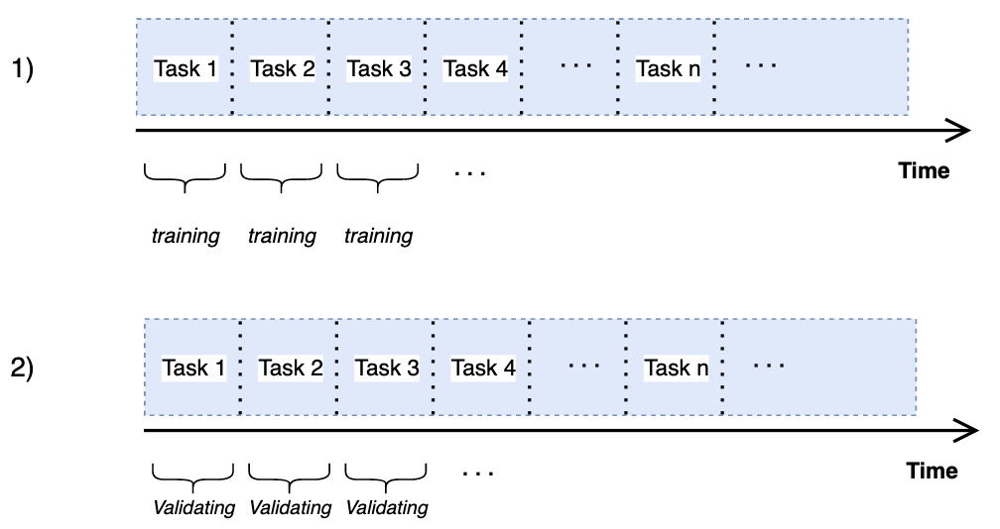
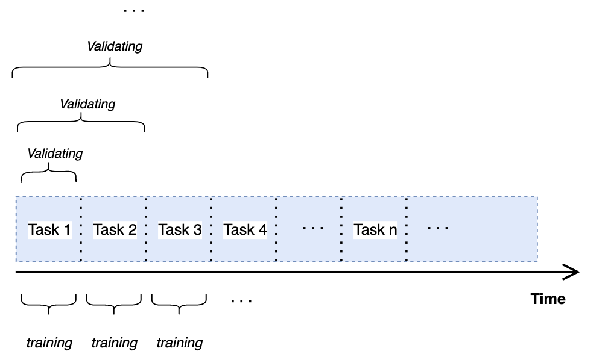

# Continual-Fewshot-Domain-Adaptation
Continual Few-Shot Unsupervised Domain Adaptation (CFUDA) is a continual learning end-to-end framework inspired by the [CVPR](http://xyue.io/pcs-fuda/) paper in 2021. 

### Overview
This study focuses primarily on analyzing the performance of two different Task-Incremental learning intuitive strategies named *Baseline* and
*Naive* algorithms as a continual learner. Besides,the model faces a stream of tasks over time an unsupervised domain adaptation technique is performed over each task while the source domain contains only a few labeled sample. 

###### Baseline Algorithm                                    
   
 

###### Naive Algorithm 
 

<!-- 

  
   

 -->

### Requirements
    conda install pytorch==1.5.1 torchvision==0.6.1 cudatoolkit=10.2 -c pytorch
    pip install -r requirements.txt
    
    

